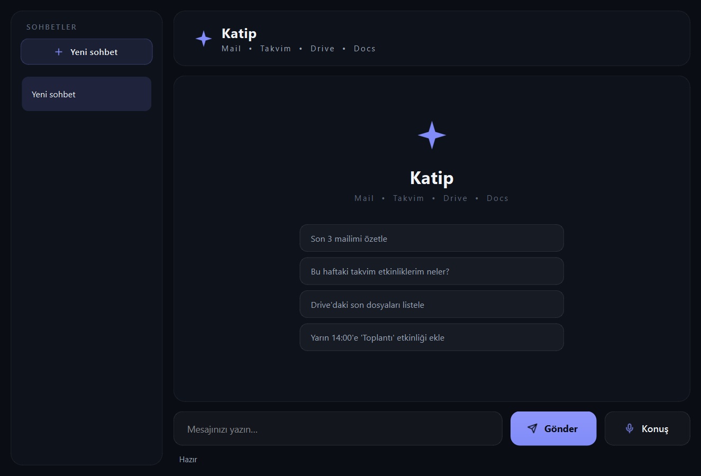
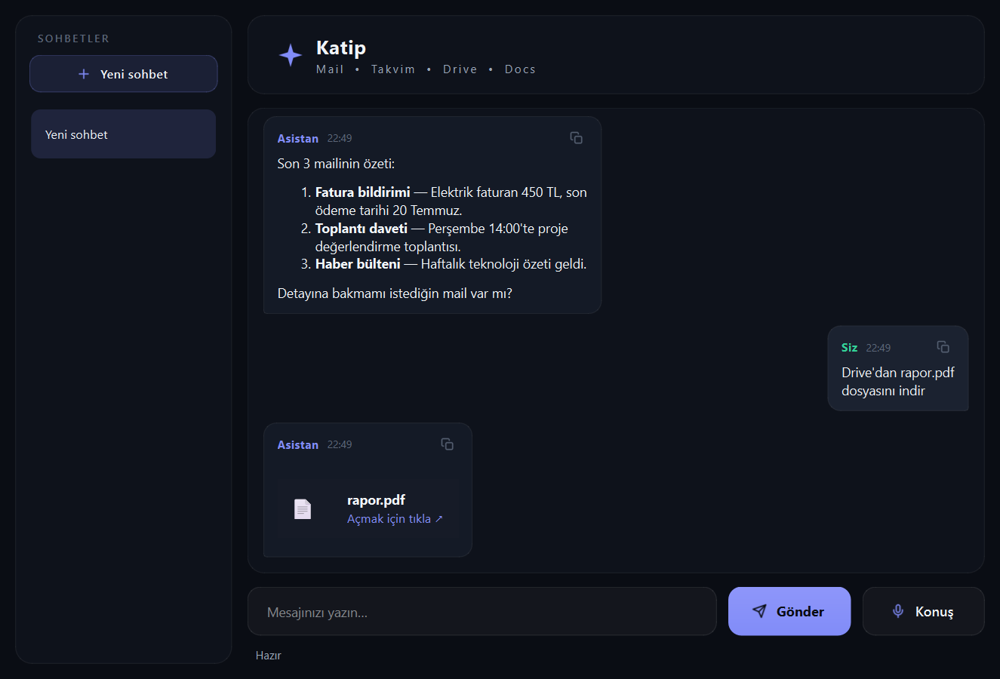

# ✦ Katip

**Your local AI clerk for Gmail, Calendar, Drive & Docs.**

Katip is a PyQt6 desktop app (Windows / Linux / macOS) that manages your Google account through voice or text commands, with AI responses generated by a **fully local** LLM via [Ollama](https://ollama.com). Your conversations and commands are never sent to any third-party AI service.


-000000)


> ⚠️ **Personal project:** Katip was built for my own use and is public **for portfolio/review purposes only**. You may view and study the code, but it **may not be used, copied, modified, or distributed without permission**. See [LICENSE](LICENSE).

**Welcome screen**



**Chat**



## ✨ Features

- 🧠 **Local AI** — Responses come from a local model via Ollama (default: `gemma3:12b`); no data goes to the cloud on the AI side
- 📧 **Gmail** — Read and search mail (text/plain + HTML body). **Read-only:** the app deliberately has no permission to send email
- 📅 **Calendar** — Add events and list upcoming ones
- 📂 **Drive** — List and download files (size-limit protected)
- 📝 **Docs** — Create documents
- 📄 **Document reading** — Read and summarize downloaded PDF / DOCX / TXT files
- 🔗 **Tool chaining** — Multi-step tasks in a single command, e.g. "list first, then download" (agentic loop)
- 💬 **Multiple chat sessions** — Open/switch/delete sessions from the sidebar; resume where you left off on restart
- ⚡ **Streaming** — Responses render token by token in real time
- 🎤 **Voice command** — Speak your command in Turkish via the microphone (*note: speech-to-text uses the Google Web Speech API and requires internet*)
- 🚫 **Cancel** — Stop long-running operations at any time

## 📂 Project Structure

```
katip/
├── core/                   # Backend logic
│   ├── config.py           # Constants, theme, environment variables
│   ├── auth.py             # Google OAuth authentication (cache + auto refresh)
│   ├── sessions.py         # Multi-session chat store (JSON, atomic writes)
│   └── tools.py            # Gmail, Calendar, Drive, Docs tools
├── ui/                     # Interface layer
│   ├── app.py              # Main window (sessions, streaming, dark title bar)
│   ├── chat_view.py        # Widget-based message bubbles + welcome screen
│   ├── icons.py            # Runtime SVG icon generation
│   ├── styles.py           # QSS theme
│   └── worker.py           # Background thread (agentic loop + voice)
├── docs/                   # Screenshots
├── main.py                 # Entry point
└── requirements.txt
```

## 🚀 Setup

1. **Install dependencies:**
   ```bash
   pip install -r requirements.txt
   ```

2. **Install Ollama and pull the model:**
   ```bash
   ollama pull gemma3:12b
   ```

3. **Configure Google API credentials:**
   - Create a project in the [Google Cloud Console](https://console.cloud.google.com/) and enable the Gmail / Calendar / Drive / Docs APIs.
   - Create an OAuth 2.0 client ID of type "Desktop app".
   - Place the downloaded file in the project root as `credentials.json`.
   - On first launch a Google consent screen opens in your browser; after you approve it, `token.json` is created automatically.

4. **Run the app:**
   ```bash
   python main.py
   ```

## ⚙️ Environment Variables (Optional)

| Variable          | Default                  | Description                 |
| ----------------- | ------------------------ | --------------------------- |
| `OLLAMA_MODEL`    | `gemma3:12b`             | Ollama model to use         |
| `OLLAMA_BASE_URL` | `http://localhost:11434` | Ollama server address       |
| `OLLAMA_TIMEOUT`  | `120`                    | Request timeout (seconds)   |

Copy the example file to get started:

```bash
cp .env.example .env
```

## 🔒 Security Notes

Katip is an AI agent that can call tools, so it includes some deliberate limits:

- **Gmail is read-only:** the OAuth scope is limited to `gmail.readonly` and there is no send-email function in the code. A malicious instruction inside an email cannot send mail on your behalf.
- **Prompt-injection awareness:** the content of emails/documents you read is passed to the model. Malicious content could try to convince the model to call *existing* tools such as adding a calendar event or creating a document. Evaluate this risk before using it with critical accounts; the tool set is deliberately kept to reversible operations.
- **Local data:** chat history (`chat_sessions.json`) and downloaded files (`downloads/`) are stored on disk in plain text and kept out of the repo via `.gitignore`. Never share your `credentials.json` or `token.json`.
- **Other protections:** path-traversal protection and an executable-extension block list on downloaded filenames, Drive query sanitization, a download size limit (100 MB), model-output HTML sanitization, and an infinite-tool-loop guard.

## 🗺️ Roadmap

- [ ] Local speech recognition (faster-whisper) — remove the internet dependency entirely
- [ ] Voice responses (TTS)
- [ ] Push-to-talk / voice activity detection
- [ ] Unit tests + CI
- [ ] Ollama native tool-calling API support

## 📄 License

**All rights reserved.** This project is *not* open source; the source code is published for portfolio/review purposes only. It may not be used, copied, or distributed without written permission. See the [LICENSE](LICENSE) file for details.
